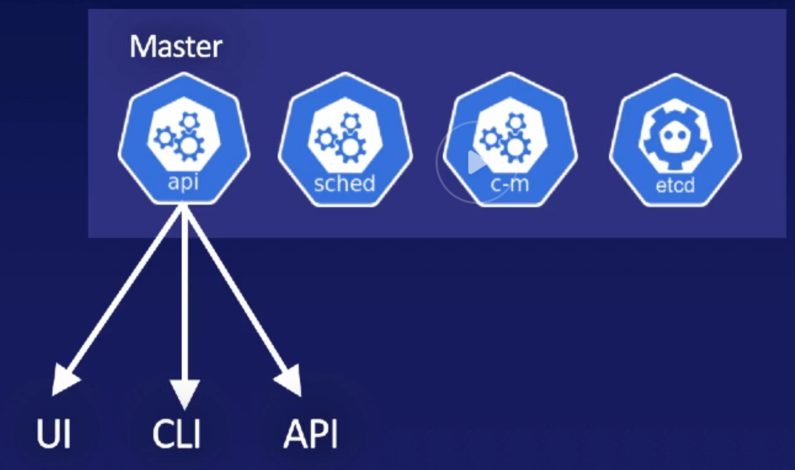
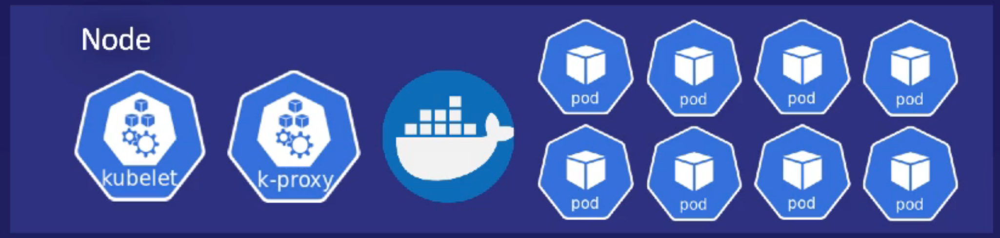

# Architecture
## Master node
The master node contains four functions. 
1. api (for cli, kubelet and ui)
1. scheduler (constantly checking that the desired state is right on the nodes)
1. controller manager
1. etcd (distributed db. The only stateful piece of the k8s master)

## node (worker node/minion)
Runs `kubelet` (communicates with the api on master) and `k-proxy`. 
The nodes exist for one purpose, to run pods. 

